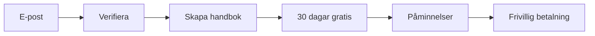
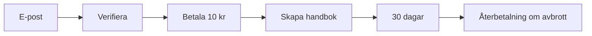

# Onboarding-Strategier för Handbok.org

## 🎯 Problem att lösa

**Användarens dilemma:** 
- Vill ge 30 dagar gratis trial
- Vill INTE be om kortuppgifter initialt
- Undrar hur funktionaliteten ska se ut efter 30 dagar

## 📊 Olika Strategier

### **Strategi 1: "Friktion-fri Trial" (Rekommenderad)**



**Flöde:**
1. Registrera med endast e-post + lösenord
2. Verifiera e-post
3. Skapa handbok direkt (ingen betalning)
4. Få 30 dagar full tillgång
5. Påminnelser: dag 23, 27, 29, 30
6. Efter 30 dagar: gradvis funktionsbegränsning

**För- och nackdelar:**
✅ **Fördelar:**
- Minimal friktion = högre konvertering till trial
- Användaren ser värdet innan betalning
- Förtroende genom transparens
- Lägre trösklar för att börja

❌ **Nackdelar:**
- Risk för "trial-hopping" med olika e-postadresser
- Högre churn-rate efter trial
- Administrativa kostnader för icke-konverterande trials
- Svårare att förutsäga intäkter

---

### **Strategi 2: "Micro-Payment Validation"**



**Flöde:**
1. Registrera med e-post
2. Betala 10 kr (validering)
3. Få full tillgång i 30 dagar
4. Efter 30 dagar: 299 kr/månad eller återbetalning av 10 kr

**För- och nackdelar:**
✅ **Fördelar:**
- Filtrerar bort icke-seriösa användare
- Lägre risk för trial-hopping
- Genererar intäkter även från kortvariga trials

❌ **Nackdelar:**
- Högre konverteringsfrktion
- Komplicerad återbetalningsprocess
- Kan avskräcka genuint intresserade användare

---

### **Strategi 3: "Ghost Payment"**

```mermiad
flowchart LR
    A[E-post] --> B[Verifiera] --> C[Ange kort<br/>0 kr] --> D[Skapa handbok] --> E[30 dagar gratis] --> F[Auto-debitering]
```

**Flöde:**
1. Registrera med e-post
2. Ange kortuppgifter (ingen laddning)
3. Få 30 dagar gratis
4. Automatisk debitering efter 30 dagar (med opt-out)

**För- och nackdelar:**
✅ **Fördelar:**
- Bästa av båda världar
- Högre konvertering efter trial
- Förenklad betalning efter trial
- Validerar seriösa användare

❌ **Nackdelar:**
- Fortfarande någon friktion vid registrering
- Risk för negativ överraskning vid debitering
- Kräver tydlig kommunikation

---

## 🏆 Rekommendation: Hybrid-Strategi

### **"Smart Progressive Onboarding"**

**Fas 1: Friktion-fri start (dagar 1-7)**
- Endast e-post krävs
- Full tillgång till alla funktioner
- Fokus på att skapa värde snabbt

**Fas 2: Värdevalidering (dag 7)**
- Om användaren har skapat innehåll: visa värdeproposition
- Erbjudande: "Lägg till betalkort för oavbruten service"
- Incentive: Extra 7 dagar gratis om kort läggs till

**Fas 3: Mjuk konvertering (dag 20-30)**
- Progressiva påminnelser
- Visa användningsstatistik och värde skapat
- Erbjud flexibla betalningsalternativ

**Implementering i din kod:**

```typescript
// Utvidga din TrialStatus interface
interface TrialStatus {
  isInTrial: boolean;
  trialDaysRemaining: number;
  trialPhase: 'early' | 'engagement' | 'conversion'; // Ny!
  hasPaymentMethod: boolean; // Ny!
  subscriptionStatus: string;
  // ... resten
}

// Ny service för onboarding-logik
export function getOnboardingStrategy(trialStatus: TrialStatus) {
  if (trialStatus.trialDaysRemaining > 23) {
    return 'focus_on_value'; // Visa funktioner, inga betalningspåminnelser
  } else if (trialStatus.trialDaysRemaining > 7) {
    return 'soft_payment_prompt'; // Mjuk prompt om betalkort
  } else {
    return 'conversion_focus'; // Tydliga konverteringsmeddelanden
  }
}
```

### **Funktionalitet efter 30 dagar**

**Vald Strategi: "Hård Cutoff" (Rekommenderad)**
- **Dag 30 23:59:** Trial går ut automatiskt
- **Dag 31 00:00:** Konto blockerat helt - måste betala för åtkomst
- **Viloläge:** Data sparas säkert tills betalning sker
- **Reaktivering:** Omedelbar åtkomst vid betalning

**Alternativa strategier (ej valda):**
- ~~Gradvis begränsning~~ (för mjuk)
- ~~Freemium-modell~~ (komplicerar värdeproposition)

## 🛠️ Implementation Roadmap

### **Steg 1: Förbättra nuvarande trial-experience**
- [x] Trial-system fungerar
- [ ] Lägg till onboarding-wizard
- [ ] Implementera progressiva påminnelser
- [ ] Lägg till värde-tracking

### **Steg 2: Experimentera med betalningsstrategier**
- [ ] A/B-testa friktion-fri vs micro-payment
- [ ] Implementera "ghost payment" som option
- [ ] Mät konverteringsraten per strategi

### **Steg 3: Optimera post-trial experience**
- [ ] Designa elegant "paused account" experience
- [ ] Skapa win-back campaigns
- [ ] Implementera flexibla pricing-optioner

## 📈 Mätpunkter

**Pre-trial metrics:**
- Conversion rate: Landing page → Trial start
- Time to first value (handbok skapad)
- Feature adoption under trial

**Post-trial metrics:**
- Trial-to-paid conversion rate
- Churn reasons
- Reactivation rate efter pause
- Customer lifetime value

**Rekommenderade mål:**
- Trial conversion rate: >35%
- Trial-to-paid conversion: >15%
- First value time: <24 timmar

---

## 🎬 Nästa steg

1. **Implementera onboarding-wizard** för bättre trial-experience
2. **A/B-testa** friktion-fri vs micro-payment på 50/50 split
3. **Mät och iterera** baserat på verklig användardata
4. **Bygga customer feedback loop** för kontinuerlig förbättring

Vill du att jag implementerar någon av dessa strategier i din befintliga kod? 