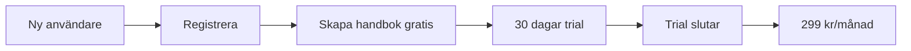

# Refaktoreringsplan: Förenkla Betalnings- och Onboarding-flödet

## 🎯 Mål: Maximalt enkel men tillräcklig lösning

Övergå från "dual-flöde" till ett enda, enkelt subscription-baserat flöde.

## 📋 Nuvarande komplexitet (att ta bort)

### Komponenter att ta bort/förenkla:
- ✅ `TrialOnboardingWizard.tsx` (286 rader) → Ersätt med enkel trial-info
- ✅ Gamla engångsbetalnings-API:er → Behåll bara subscription
- ✅ Multipla onboarding-strategier → Bara "friktion-fri trial"
- ✅ Komplexa prissystem → Fast 299 kr/månad

### API-endpoints att ta bort:
- ❌ `/api/stripe/create-checkout-session` (engångsbetalning)
- ❌ `/api/test-stripe-integration` (onödig komplexitet)
- ✅ Behåll: `/api/trial/start` + `/api/stripe/create-subscription`

## 🚀 Förenklat flöde (efter refaktorering)



### **Enda vägen för alla:**
1. **Registrera** → email + lösenord
2. **Skapa handbok** → direkt, ingen betalning
3. **30 dagar gratis** → full funktionalitet
4. **Dag 30** → Konto blockeras
5. **Betala** → 299 kr/månad för obergränsad åtkomst

## 📝 Refaktoreringsplan

### **Fas 1: Rensa bort gammalt (1-2 timmar)**

#### 1.1 Ta bort gamla betalnings-API:er
```bash
# Ta bort dessa filer:
src/app/api/stripe/create-checkout-session/
src/app/api/test-stripe-integration/
src/app/api/stripe/session/ (om bara används för gammalt flöde)
```

#### 1.2 Förenkla CreateHandbookForm
```typescript
// FÖRE: Komplex logik med två flöden
if (isEligibleForProvState) {
  // Trial-flöde
} else {
  // Betalningsflöde  
}

// EFTER: Bara ett flöde
// Alla skapar handbok gratis via trial
await fetch('/api/trial/start', { ... });
```

#### 1.3 Ta bort onödiga komponenter
```bash
# Förenkla eller ta bort:
src/components/onboarding/TrialOnboardingWizard.tsx
```

### **Fas 2: Förenkla kvarvarande (30 min)**

#### 2.1 Uppdatera trial-service
```typescript
// Ta bort onödiga strategier
interface TrialStatus {
  isInTrial: boolean;
  trialDaysRemaining: number;
  subscriptionStatus: string;
  trialEndsAt: string | null;
  canCreateHandbook: boolean;
  hasUsedTrial: boolean;
  // ❌ Ta bort: trialPhase, onboardingStrategy
}
```

#### 2.2 Förenkla miljövariabler
```env
# ❌ Ta bort gamla:
HANDBOOK_PRICE=249000

# ✅ Behåll bara:
TRIAL_DURATION_DAYS=30
STRIPE_SECRET_KEY=...
STRIPE_WEBHOOK_SECRET=...
```

### **Fas 3: Uppdatera UI (30 min)**

#### 3.1 Förenkla create-handbook-sidan
- Ta bort alla betalnings-alternativ från UI
- Visa bara: "Skapa handbok gratis → 30 dagar trial"
- Ta bort pris-visningar och komplexa trial-cards

#### 3.2 Förenkla dashboard
- Behåll bara `TrialStatusCard` (ingen TrialOnboardingWizard)
- Enkel messaging: "X dagar kvar av trial"

## 🎯 Slutresultat: "SLC" - Simple, Lovable, Complete

### **Frontend-flöde (efter cleanup):**
```typescript
// create-handbook/page.tsx - ENKEL
export default function CreateHandbook() {
  return (
    <CreateHandbookForm /> // Skapar alltid via trial
  );
}

// CreateHandbookForm.tsx - FÖRENKLAD
const handleSubmit = async () => {
  // Bara EN väg för alla användare
  const response = await fetch('/api/trial/start', {
    method: 'POST',
    body: JSON.stringify({ handbookData })
  });
  
  // Redirect till handbok
  window.location.href = result.redirectUrl;
};
```

### **Backend-flöde (efter cleanup):**
```typescript
// Bara dessa API:er behövs:
/api/trial/start          // Skapa handbok + starta trial
/api/trial/check-status   // Kontrollera trial-status
/api/stripe/create-subscription  // Upgrade från trial
/api/stripe/webhook       // Hantera betalningar
```

## ⚠️ Migreringsplan för befintliga kunder

### **Steg 1: Identifiera påverkade kunder**
```sql
-- Hitta kunder med gamla engångsbetalningar
SELECT * FROM subscriptions 
WHERE plan_type = 'one_time' OR metadata->>'stripe_session_id' IS NOT NULL;
```

### **Steg 2: Migrera automatiskt**
- Alla befintliga "engångsbetalning"-kunder → gratis 30 dagar trial
- Efter 30 dagar → vanligt subscription-flöde (299 kr/månad)
- **Kommunikation:** "Vi förbättrar vår tjänst! Du får nu obergränsade handböcker för 299 kr/månad istället för att betala per handbok."

## 🚦 Implementeringsordning

### **Prio 1: Backend cleanup (kritiskt)**
1. Ta bort `/api/stripe/create-checkout-session`
2. Uppdatera webhook för att bara hantera subscriptions
3. Migrera befintliga engångsbetalningar

### **Prio 2: Frontend cleanup (viktigt)**  
1. Förenkla `CreateHandbookForm`
2. Ta bort `TrialOnboardingWizard`
3. Uppdatera alla UI-texter

### **Prio 3: Dokumentation (bra att ha)**
1. Uppdatera README
2. Ta bort gamla konfigurationsfiler
3. Förenkla miljövariabel-dokumentation

## 📊 Förväntade resultat

### **Fördelar:**
✅ **50% mindre kod** att underhålla  
✅ **0% förvirring** för nya kunder  
✅ **Enklare testning** och debugging  
✅ **Konsekvent pricing** (299 kr/månad)  
✅ **Bättre skalbarhet** för SaaS-modell  

### **Risker:**
⚠️ **Migrera befintliga kunder** kräver kommunikation  
⚠️ **Kortare utvecklingstid** för implementering (1-3 timmar total)  

## 🏁 Nästa steg

1. **Godkänn plan** med Pontus
2. **Säkerhetskopiera** nuvarande kod  
3. **Implementera Fas 1** (ta bort gammalt)
4. **Testa** att nya flödet fungerar
5. **Implementera Fas 2+3** (förenkla resten)
6. **Kommunicera** ändringar till befintliga kunder

**Uppskattat arbete:** 2-3 timmar total för komplett cleanup 